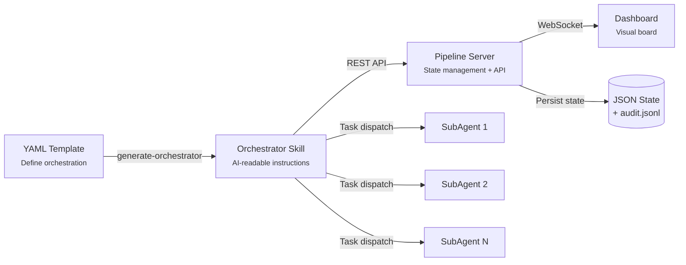
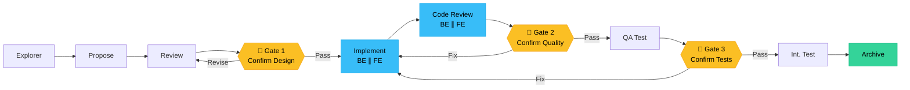
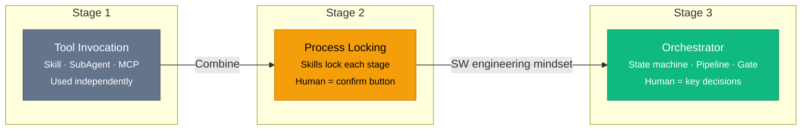

# The Orchestrator Pattern: When AI Coding Meets Software Engineering

> Treat AI Agents as the entry point to software engineering. Manage the workflow with a state machine — isn't that just using AI the way we build software?

---

**Sure.**

**Sure.**

**Sure.**

That's the word I've said more than any other while coding with AI in the past few weeks.

Not because AI isn't useful — quite the opposite, it's *too* useful. I locked every stage of my development workflow with Skills: requirements analysis, change design, coding, E2E testing, integration testing, archiving. Each step has a fixed process. Combined with Cursor's User Profile, the AI knows exactly how I prefer to communicate. So after each step, it politely asks: "Shall we move to the next stage?"

My response is always: Sure.

Until one day I realized — I had become the least technical part of the entire pipeline: **a human confirmation button**.

## 1. Skill, SubAgent, MCP — Are You Really Using Them to Their Full Potential?

If you've been using Cursor for AI-assisted coding, you've probably encountered these three concepts:

**Skill**: Defines AI behavior patterns for specific scenarios. For example, "use OpenSpec for change proposals" or "write integration tests following project conventions." It's essentially a structured prompt that makes AI perform consistently on specific tasks.

**SubAgent**: Independent execution units spawned through Cursor's Task mechanism. The main Agent can launch multiple SubAgents in parallel — one writing backend code, another writing frontend code, without interference.

**MCP** (Model Context Protocol): The protocol that connects AI to the outside world. Databases, APIs, monitoring systems — through MCP, AI is no longer just a code assistant that reads and writes files, but an operator that can reach your entire tech stack.

Most people use these three at the "point solution" level: write a Skill to unify code style, use SubAgents to run tests in parallel, configure an MCP to connect to MongoDB. That's fine, but it's only **tool-level** usage.

The real question is: **What can you achieve when you combine all three?**

## 2. From "Sure Sure Sure" to the Orchestrator Insight

### 2.1 The Days of Being Locked In by Skills

Let me explain how I became a "human confirmation button."

My development workflow was precisely controlled by six Skills:

1. **Explorer** — Analyze requirements, understand existing code
2. **Propose** — Generate change proposals using OpenSpec
3. **Review** — Technical review of proposals
4. **Implement** — Parallel frontend and backend implementation
5. **QA Test** — Run E2E tests
6. **Archive** — Archive change records

Every step's input/output, operational norms, and communication style was hardcoded into Skills. With Cursor's User Profile, AI knew I prefer concise confirmations, no explanations needed, just give me options. So the whole flow was smooth — AI finishes, asks, I say "sure," and it continues.

Efficiency was genuinely high. But something felt increasingly off.

### 2.2 We Forgot Our Software Engineering Experience

While studying [ClawTeam](https://github.com/phodal/clawteam) (an open-source CLI framework for multi-agent collaboration), I had a profound realization:

**When using AI, we somehow forgot the methodologies of software engineering.**

Think about it — if you were building a traditional CI/CD system, how would you design it?

- Define pipeline stages and their order
- Set up Gates (quality checkpoints) at critical points
- Use a state machine to manage each stage's lifecycle
- Support parallel execution and conditional branching
- Use persistent storage for state, enabling resume from interruption

This is what we've been doing for decades, right?

Now look at how we use AI for coding — manually confirming step by step, relying on memory to decide what to do next, no state persistence, starting from scratch after interruptions. This is clearly **artisan mode**.

Here comes the core insight: **An AI Agent is inherently a programmable execution unit.**

- It can determine which stage it's currently in
- It can decide what to do next based on a template
- Each stage's state can be persisted locally as a state machine
- Gate pass/fail results can be recorded persistently

See? This is just using AI the way we **build software**.

I call this the **Orchestrator Pattern**.

## 3. The Orchestrator Pattern

### 3.1 Definition

In one sentence: **Don't create new Agents — orchestrate existing ones.**

The Orchestrator doesn't write code, doesn't do design, doesn't run tests. It does exactly one thing: schedule the right Agent at the right time according to a predefined pipeline template, pausing at critical points to await human decisions.

If you're familiar with CI/CD, it's your Jenkins/GitHub Actions — except instead of driving build tasks, it drives AI Agents.

### 3.2 Architecture

The Orchestrator architecture consists of four layers:



**Layer 1: YAML Orchestration Template**

All orchestration logic is declared in YAML. A full-stack project template looks like this:

```yaml
name: go-react-fullstack
description: Go + React full-stack orchestration with parallel FE/BE

stages:
  - name: explore
    agent: explorer
    optional: true

  - name: propose
    skill: openspec-propose

  - name: review
    agent: reviewer

  - name: gate1
    gate: true
    gate_description: "Confirm design proposal"

  - name: implement
    label: "BE ∥ FE"
    parallel:
      - agent: backend-implementer
        scope: "## Backend Tasks"
      - agent: frontend-implementer
        scope: "## Frontend Tasks"

  - name: code-review
    parallel:
      - agent: backend-reviewer
      - agent: frontend-reviewer

  - name: gate2
    gate: true
    gate_description: "Confirm code quality"

  - name: qa-test
    agent: qa-tester

  - name: gate3
    gate: true
    gate_description: "Confirm test results"

  - name: integration-test
    agent: test-writer

  - name: archive
    skill: openspec-archive
```

Note several key design decisions:
- **`agent` references existing Agents** — no re-definition in the template
- **`parallel` supports parallel scheduling** — frontend and backend Implementers work simultaneously
- **`gate` is a human checkpoint** — AI pauses here, presenting quality reports and options
- **`skill` references existing Skills** — like OpenSpec's proposal and archiving workflows

**Layer 2: Orchestrator Skill**

`generate-orchestrator.ts` **deterministically generates** a Skill file (`orchestrator-{id}/SKILL.md`) from the YAML template. This Skill tells the main Agent:

- What stages the pipeline has, and where it currently is
- Which SubAgent or Skill to invoke for each stage
- How to present options at Gates
- How to report status via REST API
- How to resume after interruption

Key point: this Skill is **generated, not hand-written**. When the YAML changes, just regenerate.

**Layer 3: Pipeline Server**

A lightweight Bun HTTP service running on `127.0.0.1:19090`, providing:

- **State persistence**: Each pipeline's state saved as a JSON file
- **Audit log**: All stage transitions appended to `audit.jsonl`
- **REST API**: For the Orchestrator Skill to report stage status and Gate results
- **WebSocket**: Real-time state updates pushed to the Dashboard
- **Multi-pipeline support**: Manages multiple pipeline instances simultaneously

**Layer 4: Dashboard**

A dark-themed real-time dashboard displaying:

- Pipeline progress bar (each stage's status: pending / active / completed / failed)
- Gate pass/reject status
- Currently active SubAgents
- Audit log stream
- Multi-pipeline selector

### 3.3 Gates: Not Rubber-Stamp Confirmations

Gates are the most important design element in the Orchestrator Pattern.

In my "sure sure sure" days, every step was a confirmation point. That's equivalent to **having no quality gates** — when everything requires confirmation, confirmation loses its meaning.

Orchestrator Gates are different:

- AI **acts autonomously** in stages before a Gate — no human involvement needed
- Only at a Gate does AI pause, presenting a **quality-assessed report**
- Gates provide clear options: Pass / Fix Required / Abort

This means a 12-step pipeline might have only 3 Gates — humans only intervene when real decisions need to be made.



## 4. In Practice: How AI Follows a Predetermined Route

Enough concepts. Let's see what it actually looks like in action.

### 4.1 Automatic Orchestration — From Gate Pass to Parallel Implementation

> 💡 The screenshots below are from real development sessions.

After I confirm "Pass, continue to implementation" at Gate 1, AI's behavior is fully autonomous:

<!-- Screenshot 1: Auto-orchestration after Gate pass -->


Here's what AI did:

1. **Marked Gate 1 as passed** (called Pipeline Server API)
2. **Marked the implement stage as active**
3. **Launched two SubAgents in parallel**: Backend Implementer and Frontend Implementer
4. Both SubAgents worked in their own scopes — backend running `go test`, frontend editing component files
5. **After both completed**, automatically marked implement as done
6. **Entered code-review stage**, launching Backend Reviewer and Frontend Reviewer in parallel again

Zero human intervention throughout. AI reads the flow definition from the Orchestrator Skill and follows state machine logic.

### 4.2 Gates — Checkpoints with Quality Judgment

Not every stage passes automatically. Here's a Gate doing its real job:

<!-- Screenshot 2: QA Test Gate -->


After the QA Tester Agent finished testing, it provided a **conditional pass** conclusion:

- ✅ `rejected_count` semantics clarified
- ✅ Time parameter parsing errors now return 400
- ✅ Index Scenario description corrected
- ⚠️ W1/W2 (Frontend): Recommended fixes for UX improvement

The Gate presented three options:
1. **Pass** — continue testing (log issues as tech debt)
2. **Fix required** (specify items to fix)
3. **Abort**

When I chose "fix all," AI automatically launched Backend Implementer and Frontend Implementer in parallel to fix the corresponding issues. After fixes were complete, the flow continued automatically.

This is the value of Gates — **not asking "is this okay?" at every step, but stopping you when quality standards aren't met**.

### 4.3 Multi-Pipeline Dashboard

When you're pushing multiple features simultaneously, the dashboard looks like this:

<!-- Screenshot 3: Multi-pipeline Dashboard -->


Five pipelines running concurrently, each at different stages:
- `cloud-agent-support` — 12/12, archived ✅
- `fix-rule-subscribe-sync` — 0/12, implementation in progress
- `prom-mcp-query-guard` — 9/12, near completion
- `skill-favorite` — 0/12, just entered proposal stage
- `enhance-ratelimit-audit` — 12/12, archived ✅

Each pipeline has independent state, independent Gates, and independent audit logs. You can freely switch between different features — Pipeline Server remembers everything.

## 5. Team Value: From Individual Productivity to Organizational Capability

### 5.1 Even Experts Hit a Ceiling

Imagine you're the best AI coder on your team. You've mastered Cursor, your Skills are well-written, and your efficiency has tripled. You generously teach your teammates how to use it.

But here's the problem:

- Your experience lives in your head — forgotten after teaching
- Everyone has different habits, making processes hard to unify
- Someone skips code review, someone forgets to run tests
- You become the bottleneck — everyone comes to you with questions

**Your capability hasn't become the organization's capability.**

### 5.2 Orchestrator Turns Best Practices into Infrastructure

With the Orchestrator Pattern, things change:

**Your orchestration experience becomes YAML templates.** Which stages are required, which can run in parallel, where to set Gates — these decisions no longer live in someone's head but are codified as version-controlled, reusable configuration files.

**Team members follow the pipeline.** New hires don't need to know "when should I run code review" — the Orchestrator schedules the right Agent at the right time. They only need to make decisions at Gates.

**Different roles, different orchestrations.** Backend devs use the `go-backend-only` template, full-stack features use `go-react-fullstack`, urgent bug fixes use a streamlined `bugfix` pipeline. Same set of Agents, different orchestration strategies.

```bash
# Backend dev's daily workflow
bash init.sh -t go-backend-only -p fix-auth-bug

# Full-stack feature
bash init.sh -t go-react-fullstack -p feature-payment

# Hotfix (skip explore and propose)
bash init.sh -t hotfix -p hotfix-prod-crash
```

### 5.3 Pipeline-Oriented Development

This is a paradigm shift:

**Before**: Teach the team "how to use AI" — steep learning curve, results vary by person.

**Now**: Give the team "a pipeline that works" — best practices embedded in the orchestration, AI executes automatically, humans only decide at Gates.

This isn't about making everyone an AI expert — it's about **turning expert knowledge into executable pipelines**. Just like you don't need every developer to understand CI/CD implementation details, but everyone benefits from CI/CD.

## 6. From Point Solutions to Orchestration: Three Stages of AI Coding

Looking back at the evolution, AI coding is going through three stages:



**Stage 1: Tool invocation.** Using Skill, SubAgent, and MCP independently. Like having hammers, screwdrivers, and wrenches — a rich toolbox, but you pick each one up manually.

**Stage 2: Process locking.** Using Skills to lock each stage's operations, User Profiles to help AI understand your communication preferences. Efficiency improves dramatically, but you're still part of the process — becoming "sure sure sure."

**Stage 3: Orchestrator.** Treating AI Agents as programmable execution units, managing the entire workflow with software engineering practices (state machines, pipelines, gates). Humans shift from "confirming every step" to "making key decisions."

**This is what "intelligent cockpit" truly means.**

Not sitting in the pilot's seat pressing the confirm button repeatedly, but setting the course, letting AI cruise on autopilot, and only taking control at critical waypoints that require human judgment.

---

cursor-pipeline is open source: [GitHub](https://github.com/toheart/cursor-pipeline)

If your AI coding workflow has fallen into the "sure sure sure" loop, maybe it's time to rethink human-AI collaboration using the way we build software.
