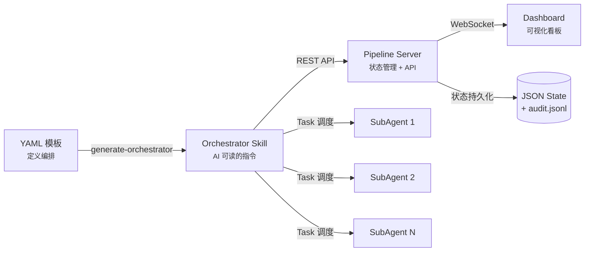
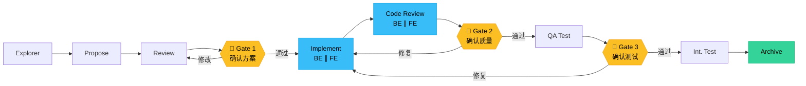
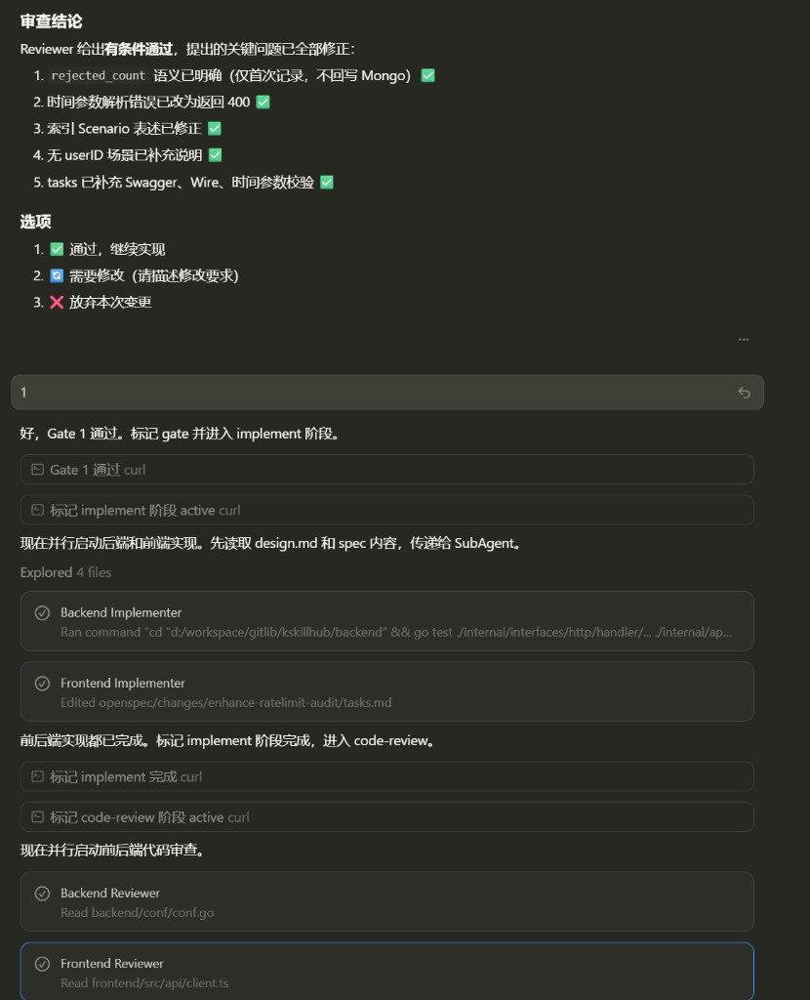
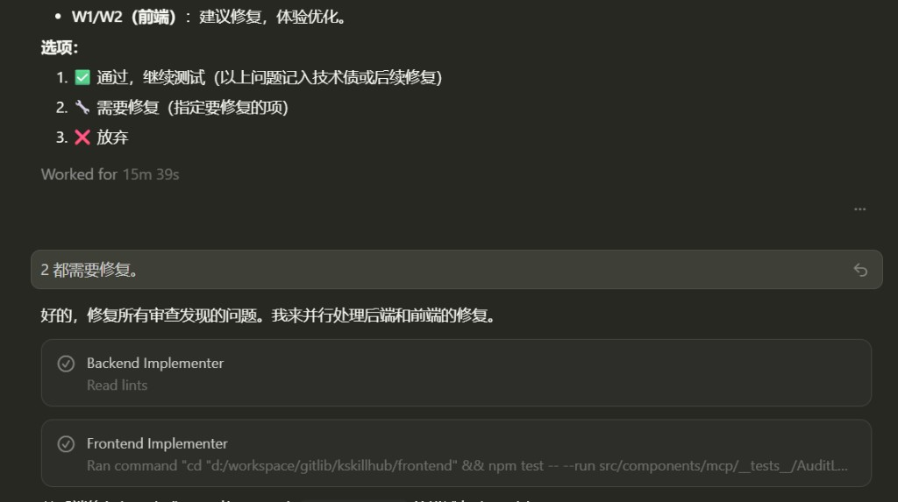
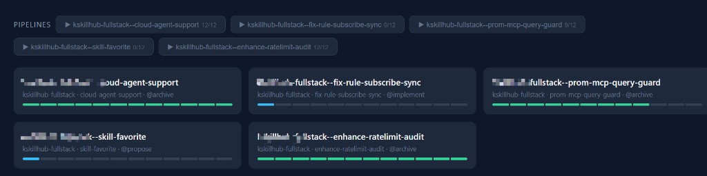
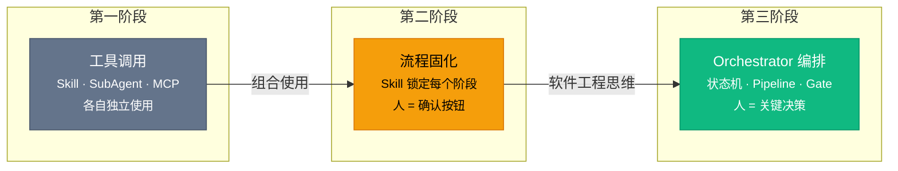

# Orchestrator 模式：当 AI 编码遇上软件工程

> 把 AI Agent 当软件工程的入口，用状态机管理流程——这不就是用"做程序"的方式在使用 AI 吗？

---

**可以。**

**可以。**

**可以。**

这是我最近几周用 AI 编码时说得最多的三个字。

不是 AI 不好用——恰恰相反，是太好用了。我把开发流程的每一个阶段都用 Skill 锁定了：需求分析、变更设计、编码实现、E2E 测试、集成测试、归档。每一步都有固定的操作流程，加上 Cursor 中的用户画像（User Profile），AI 非常清楚怎么跟我沟通。于是每完成一步，它就礼貌地问我："是否进入下一阶段？"

我的回应永远是：可以。

直到有一天我意识到——我变成了流水线上最没技术含量的环节：**一个人形确认按钮**。

## 一、Skill、SubAgent、MCP——你真的用到位了吗？

如果你已经在用 Cursor 进行 AI 辅助编码，大概率接触过这三个概念：

**Skill**（技能）：定义 AI 在特定场景下的行为模式。比如"用 OpenSpec 进行变更提案"、"按项目规范写集成测试"。它本质上是一段结构化的 Prompt，让 AI 在特定任务上表现稳定。

**SubAgent**（子智能体）：通过 Cursor 的 Task 机制派生出来的独立执行单元。主 Agent 可以同时启动多个 SubAgent 并行工作——一个写后端、一个写前端，互不干扰。

**MCP**（Model Context Protocol）：让 AI 连接外部世界的协议。数据库、API、监控系统——通过 MCP，AI 不再是一个只能读写文件的代码助手，而是能触达整个技术栈的操作者。

大多数人对这三者的使用停留在"单点调用"：写个 Skill 统一代码风格，用 SubAgent 并行跑测试，配个 MCP 连 MongoDB。这没问题，但这只是**工具层面**的使用。

真正的问题是：**当你把这三者组合起来，能做到什么？**

## 二、从"可以可以可以"到 Orchestrator 的思考

### 2.1 被 Skill 锁死的日子

先说说我是怎么走到"人形确认按钮"这一步的。

我的开发流程被六个 Skill 精确控制：

1. **Explorer**——分析需求，理解现有代码
2. **Propose**——用 OpenSpec 生成变更提案
3. **Review**——对提案进行技术审查
4. **Implement**——前后端并行实现
5. **QA Test**——运行 E2E 测试
6. **Archive**——归档变更记录

每一步的输入输出、操作规范、沟通方式都被写死在 Skill 里。加上 Cursor 的用户画像，AI 知道我喜欢简洁的确认、不需要解释原因、直接给选项。所以整个流程行云流水——AI 做完就问，我说"可以"就继续。

效率确实高。但我越来越觉得哪里不对。

### 2.2 我们忘记了做软件工程的经验

之前在研究 [ClawTeam](https://github.com/phodal/clawteam)（一个多 Agent 协作的开源 CLI 框架）的时候，我有过一个很深的感触：

**用 AI 的时候，我们反而忘了做软件工程的方法论。**

想想看——如果你在做一个传统的 CI/CD 系统，你会怎么设计？

- 定义 Pipeline 的阶段和顺序
- 在关键节点设置 Gate（质量门禁）
- 用状态机管理每个阶段的生命周期
- 支持并行执行和条件分支
- 用持久化存储保存状态，支持断点续跑

这不就是我们做了几十年的事情吗？

再看看我们怎么用 AI 编码的——手动一步步确认、靠记忆判断该做什么、没有状态持久化、中断了就从头来。这分明是**手工作坊模式**。

核心洞察来了：**AI Agent 本身就是一个可编程的执行单元。**

- 它可以判断当前处于哪个阶段
- 它可以根据模板决定下一步做什么
- 每个阶段的状态可以作为状态机保存在本地
- Gate 通过与否可以持久化记录

你看，这不就是用**做程序**的方式来使用 AI 吗？

我把这种模式叫做 **Orchestrator 模式**。

## 三、Orchestrator 模式

### 3.1 定义

一句话：**不创建新 Agent，只编排已有 Agent。**

Orchestrator 不写代码、不做设计、不跑测试。它只做一件事：按照预定义的流水线模板，在正确的时间调度正确的 Agent，在关键节点暂停等待人类决策。

如果你熟悉 CI/CD，它就是你的 Jenkins/GitHub Actions——只不过驱动的不是构建任务，而是 AI Agent。

### 3.2 架构

整个 Orchestrator 的架构由四层组成：



**第一层：YAML 编排模板**

所有编排逻辑用 YAML 声明。一个全栈项目的模板长这样：

```yaml
name: go-react-fullstack
description: Go + React 全栈编排，前后端并行

stages:
  - name: explore
    agent: explorer
    optional: true

  - name: propose
    skill: openspec-propose

  - name: review
    agent: reviewer

  - name: gate1
    gate: true
    gate_description: "确认方案设计"

  - name: implement
    label: "BE ∥ FE"
    parallel:
      - agent: backend-implementer
        scope: "## Backend Tasks"
      - agent: frontend-implementer
        scope: "## Frontend Tasks"

  - name: code-review
    parallel:
      - agent: backend-reviewer
      - agent: frontend-reviewer

  - name: gate2
    gate: true
    gate_description: "确认代码质量"

  - name: qa-test
    agent: qa-tester

  - name: gate3
    gate: true
    gate_description: "确认测试结果"

  - name: integration-test
    agent: test-writer

  - name: archive
    skill: openspec-archive
```

注意几个关键设计：
- **`agent` 字段引用已有的 Agent**，不在模板中重新定义
- **`parallel` 支持并行调度**，前后端 Implementer 同时工作
- **`gate` 是人类检查点**，AI 会在这里暂停，呈现质量报告和选项
- **`skill` 引用已有的 Skill**，比如 OpenSpec 的提案和归档流程

**第二层：Orchestrator Skill**

`generate-orchestrator.ts` 从 YAML 模板**确定性生成**一个 Skill 文件（`orchestrator-{id}/SKILL.md`）。这个 Skill 告诉主 Agent：

- 流水线有哪些阶段，当前在哪一步
- 每个阶段该调用哪个 SubAgent 或 Skill
- 遇到 Gate 时如何呈现选项
- 如何通过 REST API 上报状态
- 中断后如何恢复

关键点：这个 Skill 是**生成的，不是手写的**。YAML 变了，重新生成即可。

**第三层：Pipeline Server**

一个轻量的 Bun HTTP 服务，运行在 `127.0.0.1:19090`，提供：

- **状态持久化**：每个流水线的状态保存为 JSON 文件
- **审计日志**：所有阶段变更追加到 `audit.jsonl`
- **REST API**：供 Orchestrator Skill 上报阶段状态、Gate 结果
- **WebSocket**：实时推送状态变更给 Dashboard
- **多流水线支持**：同时管理多条流水线实例

**第四层：Dashboard 看板**

一个暗色系的实时看板页面，显示：

- 流水线进度条（每个阶段的状态：pending / active / completed / failed）
- Gate 的通过/拒绝状态
- 当前活跃的 SubAgent
- 审计日志流
- 多流水线切换选择器

### 3.3 Gate：不是形式主义的确认

Gate 是 Orchestrator 模式中最重要的设计。

在我之前"可以可以可以"的日子里，每一步都是确认点。这等于**没有质量门禁**——当一切都需要确认时，确认就失去了意义。

Orchestrator 的 Gate 不同：

- AI 在 Gate 之前的阶段**自主判断**，不需要人参与
- 只有到了 Gate，AI 才会暂停，并呈现**有质量判断的报告**
- Gate 提供明确的选项：通过 / 需要修复 / 放弃

这意味着一个 12 步的流水线，可能只有 3 个 Gate——人类只在真正需要做决策的时候介入。



## 四、实战：AI 如何按既定路线自动判断

说了这么多概念，看看实际运行是什么样的。

### 4.1 自动编排——从 Gate 通过到并行实现

> 💡 以下截图来自真实的开发会话。

当我在 Gate 1 确认"通过，继续实现"后，AI 的行为是完全自主的：

<!-- 截图1：Gate 通过后的自动编排 -->


看看 AI 做了什么：

1. **标记 Gate 1 通过**（调用 Pipeline Server API）
2. **标记 implement 阶段为 active**
3. **并行启动两个 SubAgent**：Backend Implementer 和 Frontend Implementer
4. 两个 SubAgent 各自在自己的作用域内工作——后端跑 `go test`，前端编辑组件文件
5. **两个都完成后**，自动标记 implement 完成
6. **进入 code-review 阶段**，再次并行启动 Backend Reviewer 和 Frontend Reviewer

全程零人工干预。AI 读的是 Orchestrator Skill 里的流程定义，走的是状态机逻辑。

### 4.2 Gate——有质量判断的检查点

不是所有阶段都能自动通过。看看 Gate 真正发挥作用的场景：

<!-- 截图2：QA 测试 Gate -->


QA Tester Agent 跑完测试后，给出了**有条件通过**的结论：

- ✅ `rejected_count` 语义已明确
- ✅ 时间参数解析错误已改为返回 400
- ✅ 索引 Scenario 表述已修正
- ⚠️ W1/W2（前端）：建议修复，体验优化

Gate 给出三个选项：
1. **通过**，继续测试（以上问题记入技术债）
2. **需要修复**（指定要修复的项）
3. **放弃**

当我选择"都需要修复"时，AI 又自动并行启动了 Backend Implementer 和 Frontend Implementer 去修复对应问题。修复完成后，流程自动继续。

这才是 Gate 的价值——**不是每一步都问你"行不行"，而是在质量不达标时拦住你**。

### 4.3 多流水线看板

当你同时推进多个需求时，看板长这样：

<!-- 截图3：多流水线 Dashboard -->


五条流水线同时运行，各自处于不同阶段：
- `cloud-agent-support` — 12/12，已归档 ✅
- `fix-rule-subscribe-sync` — 0/12，正在实现中
- `prom-mcp-query-guard` — 9/12，接近完成
- `skill-favorite` — 0/12，刚进入提案阶段
- `enhance-ratelimit-audit` — 12/12，已归档 ✅

每条流水线独立状态、独立 Gate、独立审计日志。你可以在不同需求间自由切换，Pipeline Server 帮你记住一切。

## 五、团队价值：从个人提效到组织能力

### 5.1 个人再牛也有瓶颈

假设你是团队里最懂 AI 编码的人。你把 Cursor 玩得很溜，Skill 写得很好，工作效率翻了三倍。你也热心地教团队成员怎么用。

但问题来了：

- 你的经验在你脑子里，教完就忘
- 每个人的操作习惯不同，流程难以统一
- 有人跳过了 code review，有人忘了跑测试
- 你成了团队的瓶颈——所有人遇到问题都来问你

**你的能力没有变成组织的能力。**

### 5.2 Orchestrator 让最佳实践变成基础设施

有了 Orchestrator 模式，事情就不一样了：

**你的编排经验变成 YAML 模板。** 哪些阶段必须有、哪些可以并行、哪里设 Gate——这些决策不再存在于某个人的脑子里，而是固化为可版本化、可复用的配置文件。

**团队成员按流水线执行。** 新人不需要知道"什么时候该跑 code review"——Orchestrator 会在正确的时机调度正确的 Agent。他只需要在 Gate 做决策。

**不同角色、不同编排。** 后端开发用 `go-backend-only` 模板，全栈需求用 `go-react-fullstack`，紧急 Bug 修复用精简的 `bugfix` 流水线。同一套 Agent，不同的编排策略。

```bash
# 后端同学的日常
bash init.sh -t go-backend-only -p fix-auth-bug

# 全栈需求
bash init.sh -t go-react-fullstack -p feature-payment

# 紧急修复（跳过 explore 和 propose）
bash init.sh -t hotfix -p hotfix-prod-crash
```

### 5.3 面向流水线的开发模式

这是一个范式转变：

**过去**：教团队"怎么用 AI"——学习曲线陡，效果因人而异。

**现在**：给团队"一条跑得通的流水线"——最佳实践内嵌在编排里，AI 自动执行，人只在 Gate 决策。

这不是让大家都成为 AI 专家，而是**把专家的经验变成可执行的流水线**。就像你不需要每个开发者都懂 CI/CD 的实现细节，但每个人都能从 CI/CD 中受益一样。

## 六、从单点到编排：AI 编码的三个阶段

回顾整个演进过程，AI 编码正在经历三个阶段：



**第一阶段：工具调用。** 单独使用 Skill、SubAgent、MCP，各自发挥作用。就像你有了锤子、螺丝刀、扳手——工具箱很丰富，但每次都是手动拿取。

**第二阶段：流程固化。** 用 Skill 锁定每个阶段的操作，用户画像让 AI 理解你的沟通偏好。效率大幅提升，但人还是流程的一部分——变成了"可以可以可以"。

**第三阶段：Orchestrator 编排。** 把 AI Agent 当作可编程的执行单元，用软件工程的方式（状态机、Pipeline、Gate）来管理整个流程。人从"每步确认"变成"关键决策"。

**这才是"智能座舱"的真正含义。**

不是让你坐在驾驶位上一直按确认键，而是设定好航线，AI 自动巡航，只在需要人类判断的关键节点接管控制。

---

cursor-pipeline 已开源：[GitHub](https://github.com/toheart/cursor-pipeline)

如果你的 AI 编码流程也陷入了"可以可以可以"的循环，也许是时候用做软件工程的方式，重新思考人与 AI 的协作模式了。

---

**关注公众号「小唐的技术日志」**，获取更多 AI 编码实战经验分享。

如果这篇文章对你有启发，欢迎**转发、点赞、在看**三连支持。

你在 AI 编码过程中踩过哪些坑？或者你有自己的编排思路？欢迎在**评论区**聊聊，我会一一回复。
