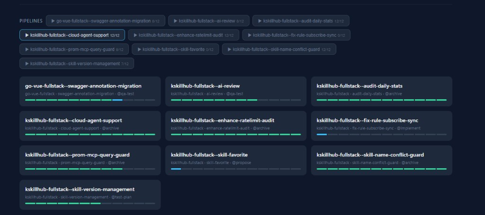

# 你真的会用 SubAgent 吗？

> 在不确定中寻求确定性——SubAgent 的价值不是让 AI 干更多活，而是让 AI 干得更准。

---

上篇文章《Orchestrator 模式》发出后，有不少朋友私信问我 SubAgent 的细节。那篇文章的重点是整体编排思路，很多细节没有展开——一方面是我还在持续完善这个模型，另一方面确实有太多东西要看。

周末闲来无事，翻了翻 GitHub，发现了现在 star 最高的 AI编码 技能框架——[Superpowers](https://github.com/obra/superpowers)（127k+ stars）。很有意思，这个框架也开始用 SubAgent 来做执行了。果然写代码写得多的人，想法都是一样的。

再比如 Anthropic 前几天发的 [Harness Design](https://www.anthropic.com/engineering/harness-design-long-running-apps) 文章，他们用 Generator-Evaluator-Planner 三 Agent 架构来做长时间自主编码，本质上也是我去年就在探索的 AI 方法论——**把大任务拆成小任务，让专业的 Agent 做专业的事，用结构化的产物在 Agent 之间传递上下文**。

这让我想说一句题外话：AI 时代你该学什么？不是学某个工具怎么用，而是学**方法论**。工具会变，方法论不会。但这个话题太大了，后面我再展开。

回到正题。

## 一、先搞清楚问题，再谈解决方案

SubAgent 在去年底发布之初就进入了大家的视野。很多人的第一反应是：给每个流程点创建一个对应的 SubAgent。

这没有错，但还不够。

我有一个习惯：出现一个新技术时，我不会急着用，而是先消化。直到研究 [ClawTeam](https://github.com/phodal/clawteam)（一个多 Agent 协作框架）时，我才真正想清楚了 SubAgent 该怎么用。

不是从功能出发，而是**从问题出发**。

### AI 最难解决的两个问题

在我之前最喜欢说的一句话是：**AI 时代，在不确定中寻求确定性。** 那么，现在 AI 最难解决的问题是什么？

**幻觉**和**注意力衰减**。

这两个问题是大模型的"原罪"，不是 bug，是 feature——或者说，是统计学的必然结果。OpenAI 的研究论文明确指出：幻觉源于预训练阶段最小化损失函数的统计压力，**无法根除，只能缓解**。

怎么理解？

你可以把 AI 想象成一个人。你叭叭叭叭给它一个任务，它自己思考了非常多，然后又跟你讨论了非常久，接着写代码、写测试、写 everything——全在一个会话里。当然，Agent 做了优化，会自动压缩记忆（compaction）。

但问题是：**上下文稀释效应是真实存在的。**

研究显示，即使在 100% 完美检索的情况下，随着输入长度增加，模型性能仍会下降 13.9% 到 85%。更要命的是"中间遗忘"现象——当关键信息出现在上下文中间位置时，准确率下降超过 20 个百分点，有时候甚至比没有上下文还差。

如果你是 AI，面对一个塞满了需求讨论、方案推演、代码实现、测试结果的上下文窗口，你能不跑偏吗？想想读书时一堂 45 分钟的课你都会走神，而现在 AI 接收到的信息量比那堂课大了不知道多少倍。

Anthropic 在 Harness Design 文章中也观察到了同样的问题。他们发现 Claude Sonnet 4.5 在长任务中会出现"上下文焦虑"（context anxiety）——模型一旦觉得自己快到上下文极限了，就会开始草草收工。压缩记忆（compaction）并不能完全解决这个问题，因为模型没有真正拿到一个"干净的石板"。

所以问题摆在面前了：**我们需要做什么？**

## 二、从问题出发，重新审视 SubAgent 的四个特性

SubAgent 有四个核心特性：上下文隔离、并行执行、专业化人格（Specialized Expertise）、可复用性（Reusability）。

很多人看到这四个特性，觉得"很牛逼，可玩度很高"。确实是，但如果只停留在"很酷"的层面，你就浪费了 SubAgent 真正的价值。

我换了一个角度来看：**每个特性，对应着 AI 的一个弱点。**

### 2.1 上下文隔离 → 对抗幻觉

这是 SubAgent 最被低估的特性。

传统做法是：在一个主 Agent 会话里，从需求分析到写代码到跑测试一路到底。信息量越来越大，上下文越来越脏，模型的注意力被稀释，幻觉率飙升。

SubAgent 的上下文隔离改变了这个局面。

在一个需求中，主 Agent 和你讨论完，产出了 task 文档。然后把这个 task 指定给对应的 SubAgent 来完成。这个 SubAgent 的输入是什么？

**只有 task 描述 + 项目规章制度。仅此而已。**

没有之前的讨论记录，没有方案推演的过程，没有其他 task 的干扰。SubAgent 拿到的是一个干净的、聚焦的、信息量极小的上下文。

这时候，让 Opus 4.6、GPT-5.4 这样的杰出大模型来干这点小活，轻而易举。你也可以试试 GLM-5.1，对于聚焦的小任务，这些模型的表现都非常好。

关键公式：**你的输入稳定（结构化的 task 文档）+ AI 的信息量少（隔离的上下文）= 准确度高**。

到这里，第一个特性就用对了。不是"因为它能隔离所以我用它"，而是**"因为我需要对抗幻觉和注意力衰减，所以我需要隔离"**。

这跟 Anthropic 的做法不谋而合——他们在 Harness Design 中的核心方案也是 **context reset**（上下文重置）：清空整个上下文窗口，启动一个全新的 Agent，通过结构化的交接产物把前一个 Agent 的状态和下一步任务传递过去。本质上就是隔离。

### 2.2 并行执行 → 压缩时间

在全栈开发过程中，我们往往需要做什么？前端开发 + 后端开发。

传统做法是：先写后端，写完再写前端。或者在一个会话里来回切换。不管怎么做，都是串行的。

有了 SubAgent，直接把前后端开发分割开：

- **Backend Implementer**：专注后端代码开发
- **Frontend Implementer**：专注前端代码开发
- **Backend Reviewer**：后端代码审查
- **Frontend Reviewer**：前端代码审查

四个 SubAgent 可以两两并行——开发阶段前后端并行，Review 阶段前后端并行。你的时间消耗直接砍半。

这不是什么高深的道理，但你得真正去做才会感受到差异。当你看到两个 SubAgent 同时工作，一个在跑 `go test`，一个在编辑 React 组件，而你只需要等它们都完成就行——那种感觉，就像从单核 CPU 升级到了多核。

### 2.3 专业化人格 → 专人专事

开发完了，接下来要做什么？自动化测试、集成测试。

如果还是让同一个 Agent 来做，它脑子里装着刚才写的代码、设计方案、架构决策——这些信息对测试来说都是噪音。一个既是开发者又是测试者的 Agent，就像一个自己批改自己作业的学生，很难真正客观。

Anthropic 的 Harness Design 文章专门讨论了这个问题：**Agent 在评估自己产出的工作时，倾向于自信地夸赞自己的成果——即使在人类观察者看来质量明显平庸。** 他们的解法是把"做事的 Agent"和"评判的 Agent"分开，形成 Generator-Evaluator 架构。

SubAgent 的 Specialized Expertise 特性天然支持这一点：

- 一个 SubAgent 专门**写测试**（Test Writer），它的 prompt 聚焦于测试覆盖率、边界条件、异常场景
- 一个 SubAgent 专门**执行测试**（QA Tester），它的 prompt 聚焦于严格验证、Bug 报告、质量评估

不同的角色，不同的 prompt，不同的专注领域。就像一个团队里有开发、有 QA、有 Code Reviewer——每个人各司其职。

是不是很完美？

### 2.4 可复用性 → 一次编写，多次执行

这个就不用多说了。因为 SubAgent 的定义是 `.md` 文件（Markdown），存放在 `.cursor/agents/` 目录下，天然具备版本控制和复用能力。

一次编写，多个项目使用。团队里一个人写好，所有人受益。就像你写一个好的 CI/CD 配置文件一样——写一次，跑无数次。

## 三、压榨干了？还缺一个 Leader

到这里，SubAgent 的四个特性我们都用上了，价值也压榨干了。

但还有一个问题：**谁来协调这些 SubAgent？**

一开始，我试图用一个主 Agent 来做协调。主 Agent 读取流程定义，依次调度各个 SubAgent，在 Gate 暂停等待人类决策。

然后我碰到了一个限制：**SubAgent 不允许嵌套。**

也就是说，主 Agent 启动的 SubAgent 内部不能再启动 SubAgent。这在架构上是合理的（防止递归爆炸），但也意味着你不能简单地用"Agent 套 Agent"的方式来构建复杂的编排逻辑。

怎么办？

我的解法是：**用 Skill 来做全盘控制。**

Skill 不是 Agent，它是一段结构化的指令，告诉主 Chat 该怎么做。主 Chat 读取 Skill 后，变成了一个有明确行动计划的执行者——它知道当前在哪个阶段，下一步该调度哪个 SubAgent，什么时候该暂停等待人类决策。

这就是上篇文章提到的 Orchestrator 模式的核心——**Skill 是 Leader，SubAgent 是 Worker，主 Agent 是读取 Skill 指令的执行引擎。**

最终形成的效果就是这样：

十条流水线同时跑，每条都处于不同阶段，每条都有独立的 SubAgent 在干活，每条都有独立的 Gate 在把关。整个过程自动流转，我只在 Gate 做决策。

## 四、英雄所见略同

写到这里，我想分享一些有趣的"撞车"现象。

### Superpowers：127k Stars 的验证

[Superpowers](https://github.com/obra/superpowers) 是目前 GitHub 上 star 最高的 Cursor 技能框架。在最近的 v5.0.6 版本中，它也开始大量使用 SubAgent 来做执行——规范化需求、设计审批、SubAgent 驱动开发。

有意思的是，它的核心理念和我的 Orchestrator 模式高度一致：

- **先澄清需求，再动手写代码**
- **把设计方案拆成可消化的块给人审批**
- **用 SubAgent 驱动自主执行**
- **强调 TDD 和 YAGNI 原则**

更有意思的是，Superpowers 在最新版本中做了一个优化：把 SubAgent 审查循环替换成了内联的自审查清单，执行时间从约 25 分钟降到约 30 秒。这说明什么？**SubAgent 不是越多越好，而是用在真正需要隔离的地方。** 审查这种轻量级任务，内联做反而更高效。

### Harness Design：Anthropic 的方法论

Anthropic 最近发表的 [Harness Design for Long-Running Application Development](https://www.anthropic.com/engineering/harness-design-long-running-apps) 一文，跟我去年探索出来的 AI 方法论几乎完全一致。

他们的核心架构是 **Planner → Generator → Evaluator** 三个 Agent：

| 角色 | 职责 | 对应我的 Orchestrator |
|------|------|----------------------|
| Planner | 把一句话需求扩展成完整的产品规格 | Explorer + Propose |
| Generator | 按照规格一个功能一个功能地实现 | Backend/Frontend Implementer |
| Evaluator | 用 Playwright 像真实用户一样点击测试 | QA Tester + Reviewer |

他们的关键发现也跟我的经验完全吻合：

1. **上下文重置比压缩记忆更有效**——清空重来，用结构化产物传递状态
2. **做事的和评判的必须分开**——自己批改自己作业不行
3. **任务分解是关键**——大任务拆成小 Sprint，每个 Sprint 聚焦一个功能
4. **评估标准要具体可判分**——不是问"好不好"，而是问"是否满足这 27 条标准"

更深层的启示是他们对 Harness 演进的思考：**Harness 中的每个组件都编码了一个假设——"模型自己做不到这件事"。这些假设值得反复检验，因为随着模型进步，它们会很快过时。**

这跟我对 Orchestrator 模式的理解完全一致：编排不是写死的，而是随着模型能力的提升不断简化的。当 Opus 4.6 比 Opus 4.5 有了显著提升后，Sprint 分解结构就可以去掉了，因为模型本身已经能持续连贯地工作两个小时以上。

### ClawTeam：Agent 自组织

[ClawTeam](https://github.com/phodal/clawteam) 是一个多 Agent 协作的开源框架，走的是另一条路——Agent 自组织。每个 Worker 获得自己的 git worktree、tmux 窗口和身份标识，通过 CLI 命令相互通信。

它给了我最初的启发：**AI 编码不是单打独斗，而是团队协作。** 这个团队里的"人"恰好都是 AI 而已。

## 五、AI 时代该学什么？

最后聊一个大话题，不展开，只点一下。

回顾上面的分析——Superpowers、Harness Design、ClawTeam、我的 Orchestrator 模式——你会发现一个规律：**大家最终都走到了同一条路上。**

不是因为大家互相抄，而是因为**软件工程的底层方法论**在那里。任务分解、关注点分离、质量门禁、并行流水线、状态机管理——这些东西存在了几十年，不会因为 AI 而消失。恰恰相反，AI 让这些方法论变得更加重要。

所以 AI 时代该学什么？

不是学 Cursor 怎么用（工具会变），不是学 Prompt 怎么写（模型会进化），而是学**软件工程的底层思维**。学会怎么拆问题、怎么管流程、怎么做质量控制、怎么让个人经验变成组织能力。

这些能力，不管 AI 怎么进化，你都用得上。

---

cursor-pipeline 已开源：[GitHub](https://github.com/toheart/cursor-pipeline)

上篇文章：[Orchestrator 模式：当 AI 编码遇上软件工程](orchestrator-pattern-zh.md)

---

**关注公众号「小唐的技术日志」**，获取更多 AI 编码实战经验分享。

如果这篇文章对你有启发，欢迎**转发、点赞、在看**三连支持。

你在使用 SubAgent 过程中有什么心得或踩过什么坑？欢迎在**评论区**聊聊。
